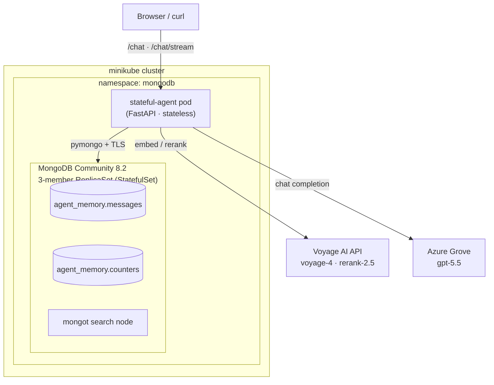

# Building Production-Style Agent Memory for AI Workloads on Kubernetes
### A 20-minute tech talk

---

## Talk framing (read this first)

**Core thesis:** LLM agents are stateless request handlers. Everything that makes an
agent feel intelligent — that it *remembers you*, retrieves the right context, and
improves over time — lives in the **memory layer**, not the model. This talk is about
**architecting that memory layer as a real system**: durable, concurrency-safe,
retrievable, and operable on Kubernetes.

**Audience:** platform/infra engineers and backend devs who deploy AI workloads.
Assumes familiarity with k8s and REST, not with vector search.

**What I demo, live, from a running cluster:** a stateful agent whose entire brain is a
MongoDB replica set running *inside* minikube — no managed Atlas cluster.

**Timing budget (20 min):**

| Section | Min | Slides |
|---|---|---|
| 1. The problem: agents are amnesiacs | 2 | 1–2 |
| 2. Architecture overview | 3 | 3–4 |
| 3. The memory document & the concurrency trap | 4 | 5–7 |
| 4. Retrieval: hybrid search + rerank | 4 | 8–10 |
| 5. Making it "agentic": the tool loop | 2 | 11 |
| 6. Kubernetes topology & operability | 3 | 12–14 |
| 7. Live demo + close | 2 | 15 |

---

## Section 1 — The problem: agents are amnesiacs (2 min)

**Slide 1 — Hook.**
> "An LLM has no memory. Every API call is a blank slate. The context window is RAM
> that's wiped after every request. If your agent 'remembers' anything, *you* built the
> persistence — and most people bolt it on as an afterthought."

**Slide 2 — What 'production-style memory' actually requires.** The four hard
requirements the rest of the talk answers:

1. **Durability** — state survives pod restarts; the agent pod must be disposable.
2. **Concurrency-safety** — many turns, many sessions, no corruption.
3. **Relevant retrieval** — recall the *right* 3 memories from thousands, not keyword soup.
4. **Operability** — lifecycle, observability, and controls (TTL, retention) an SRE can reason about.

Land the design principle: **the agent is stateless; the database is the agent's brain.**

---

## Section 2 — Architecture overview (3 min)

**Slide 3 — The one-diagram architecture** (walk it left-to-right):



**Slide 4 — Key decisions & why.**
- **MongoDB as the single memory store.** One database gives operational storage *and*
  vector search *and* full-text search — no separate vector DB to sync. Vector index +
  BM25 index live next to the documents.
- **Runs in-cluster, not Atlas.** The whole point: you can run this stack on your own
  k8s. Two hosted APIs (embeddings/rerank, LLM) are called over the network; **the state
  layer is yours.**
- **Stateless agent, StatefulSet database.** The split that makes the agent horizontally
  scalable and the data durable.

---

## Section 3 — The memory document & the concurrency trap (4 min)

**Slide 5 — One turn = one document.**

```json
{
  "_id": "uuid",
  "session_id": "meetup-demo",
  "role": "user | assistant | system",
  "content": "the message text",
  "embedding": [0.01, -0.02],
  "timestamp": "2026-07-05T12:00:00Z",
  "created_at": "ISODate(...) — BSON Date, for TTL",
  "turn": 7
}
```

Call out the **two time fields on purpose**: a human-readable ISO string for display,
and a BSON `Date` because *TTL indexes only act on Date-typed fields.* This detail
separates a demo from a system.

**Slide 6 — The concurrency trap (the meat of the talk).**
Pose it to the room: *"How do you number turns 0, 1, 2, … when two requests for the same
session land at once?"*

The naive answer — `count()` then `insert` — is a **read-then-write race**: two writers
both read `count=6`, both write `turn=7`. Recent-history ordering is now corrupt.

The fix — an **atomic per-session counter** in a sibling collection:

```python
def _next_turn(self, session_id):
    doc = self.counters.find_one_and_update(
        {"_id": session_id},
        {"$inc": {"seq": 1}},
        upsert=True,
        return_document=ReturnDocument.AFTER,
    )
    return doc["seq"] - 1
```

`findOneAndUpdate` + `$inc` is atomic server-side — every writer gets a distinct,
monotonically increasing value. **Belt and suspenders:** `(session_id, turn)` is a
**unique index**, so even a bug can't silently write a duplicate.

**Slide 7 — Honest engineering: gaps are fine.**
The turn is reserved *before* embedding/insert. If a later step fails, that turn number
is "burned" — the sequence stays strictly increasing but may have gaps. Reads order by
`turn`, so **gaps are harmless.** The point: *a correct system that admits its tradeoffs
beats a "perfect" one that hides them.*

---

## Section 4 — Retrieval: hybrid search + rerank (4 min)

**Slide 8 — Why one search algorithm isn't enough.**
- **Vector search** (`$vectorSearch` over voyage-4 embeddings) captures *meaning* —
  "what language do I like?" matches "I prefer Rust." Fuzzy on exact terms, IDs, names.
- **Full-text / BM25** (`$search`) nails *exact* tokens but misses paraphrase.
- Production recall needs **both.**

**Slide 9 — `$rankFusion`: fuse two rankings in one query.** MongoDB 8's `$rankFusion`
runs both sub-pipelines and reciprocal-rank-fuses them server-side — one round trip,
equal weights:

```python
{"$rankFusion": {
   "input": {"pipelines": {"vector": vector_pipeline, "text": text_pipeline}},
   "combination": {"weights": {"vector": 1, "text": 1}},
}}
```

Two engineering notes: session scoping happens *inside* each sub-pipeline's `filter`
(sub-pipelines can't carry a `$limit`), and it's all one aggregation — no client-side
merge logic.

**Slide 10 — Rerank: the precision stage.** Fusion gives good *recall* (~10 candidates);
a **cross-encoder reranker** (Voyage `rerank-2.5`) gives *precision* by re-scoring
query↔document pairs directly, keeping the top 3. This is the demo's money shot — show
the **before vs. after** ordering flip live. *Retrieval is a funnel: cheap-and-broad,
then expensive-and-sharp.*

Optional depth: **embed-once optimization** — the user message is embedded a single time
per turn and the vector is threaded through hybrid search *and* the stored document,
instead of re-embedding 2–3×. Latency and API-cost win.

---

## Section 5 — Making it "agentic": the tool loop (2 min)

**Slide 11 — From RAG responder to agent.** RAG retrieves *before* answering. An agent
decides *mid-turn* what it needs. We bind three tools and run a bounded
**plan → act → observe** loop (max 4 iterations):

- `search_memory(query)` — hybrid + rerank over its own memory on demand
- `save_fact(fact)` — persist a durable fact as a `system` turn
- `get_current_time()` — resolve relative time ("next Friday" → a date)

The bound (`MAX_TOOL_ITERS`) is the operability point: **agents must have a leash** or
they loop forever and burn tokens. Every tool call increments a metric.

---

## Section 6 — Kubernetes topology & operability (3 min)

**Slide 12 — The topology, mapped to k8s primitives.**
- **MongoDB Community Operator** manages a **3-member ReplicaSet** as a `StatefulSet` —
  stable network identity + a `PersistentVolumeClaim` per member (durable state).
- **cert-manager** issues a local CA and TLS certs; **mongod ↔ mongot and
  client ↔ mongod are TLS-encrypted.** The agent mounts the CA and connects over TLS.
- **SCRAM auth**, least-privilege user (`readWrite` on `agent_memory` only), secrets for
  passwords, connection string injected via a generated Secret.
- **The agent is a plain `Deployment`** — stateless, restartable, scalable — reading
  config from a `ConfigMap` (models, index names, `MAX_TOOL_ITERS`, TTL/retention knobs).

Land it: *StatefulSet for the data, Deployment for the compute — the split is the architecture.*

**Slide 13 — Lifecycle & observability (SRE lens).**
- **TTL index** on `created_at` (`MEMORY_TTL_SECONDS`) auto-expires old turns — and the
  code **reconciles**: set it to 0 and the index is *dropped*, so disabling actually
  disables. (The bug we caught: a stale TTL index kept expiring data after "disable."
  Config must be declarative *and* enforced.)
- **Per-session retention** (`MAX_TURNS_PER_SESSION`) trims to the newest N on write.
- **`/metrics`** — Prometheus-format counters: requests by route/outcome, tool calls by
  name, messages saved by role. **`/health`** for liveness/readiness.

**Slide 14 — Testing a stateful system.** Two-tier strategy:
- **Hermetic tier** (`mongomock`, default) — runs offline in CI, no cluster; covers
  schema, turn sequencing, retention trim, TTL reconciliation.
- **Real-backend tier** — a concurrency test that only runs against a real MongoDB
  (`TEST_MONGODB_URI`), because *true atomicity can only be verified server-side.*
  **You cannot mock your way to confidence about concurrency** — test the contract where
  it's actually enforced.

---

## Section 7 — Live demo + close (2 min)

**Slide 15 — Live demo** (already running; UI at `http://127.0.0.1:8080/`):
1. New session → **teach a fact** ("my deadline is next Friday"). Expand
   **Sources & Tools** — watch it call `get_current_time` + `save_fact`, streaming tokens.
2. **Recall** in a new question → show retrieved memory with rerank scores.
3. **Rerank tab** → the before/after ordering flip.
4. **`/metrics`** → `agent_tool_calls_total` ticked up.

**Closing line:**
> "The model is a commodity you rent by the token. The **memory layer is the system you
> own** — and if you architect it like real infrastructure (atomic writes, hybrid
> retrieval, TTL, metrics, tests, running on your own k8s), your agent stops being a
> stateless chatbot and becomes a stateful service you can actually operate."

---

## Speaker notes / anticipated Q&A
- **"Why not a dedicated vector DB?"** One store = one thing to operate, back up, secure,
  keep consistent; no dual-write sync between an operational DB and a vector DB. Vector +
  BM25 + documents co-located.
- **"Does this scale horizontally?"** The agent is stateless — scale the Deployment
  freely. The ReplicaSet scales reads via secondaries; writes go to the primary. The
  atomic counter is a single-document update, cheap and safe under load.
- **"Cross-session / per-user memory?"** Today keyed by `session_id`; the same pattern
  extends to a `user_id` scope — a natural next slide if asked.
